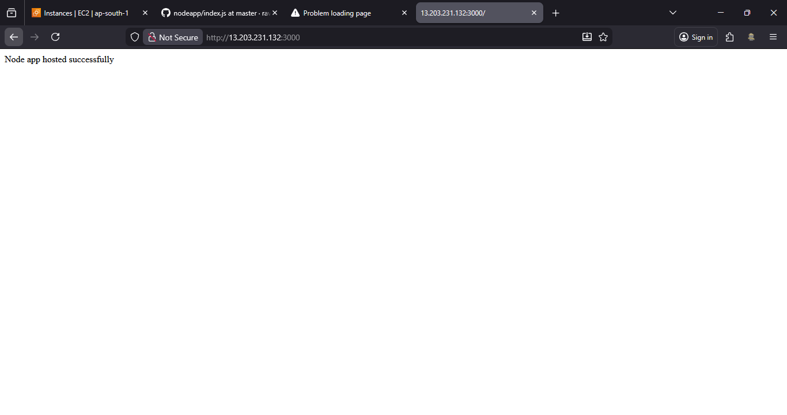

# Node.js Application Deployment

 This project demonstrates how to deploy a Node.js application on a Linux server using **Nginx as a reverse proxy** and **PM2 as a process manager runs application in background**.
---
## 📌 Prerequisites
- Linux server with sudo access
- Open port **80** (HTTP) and **3000** (Node app – internal)
---

## 🛠️ Step-by-Step Setup

### 1️⃣ System Update & Upgrade
```bash
sudo yum update -y
sudo yum upgrade -y
```
### 2️⃣ Install Node.js & NPM
```bash
sudo yum install nodejs -y
node -v
npm -v
```
### 3️⃣ Create Node.js Application
```bash
mkdir nodeapp
cd nodeapp
nano package.json
nano index.js
npm install
node index.js
```
> App runs on port **3000**

### 4️⃣ Install & Configure Nginx
```bash
sudo yum install nginx -y
sudo service nginx start
sudo nano /etc/nginx/nginx.conf
```
Nginx reverse proxy config:
```nginx
location / {
    proxy_pass http://localhost:3000;
}
```
Restart Nginx:
```bash
sudo service nginx restart
```
### 5️⃣ Install PM2 to runs application in background
```bash
sudo npm install -g pm2
pm2 --version
pm2 start index.js
pm2 stop index.js
```
## ✅ Final Result




