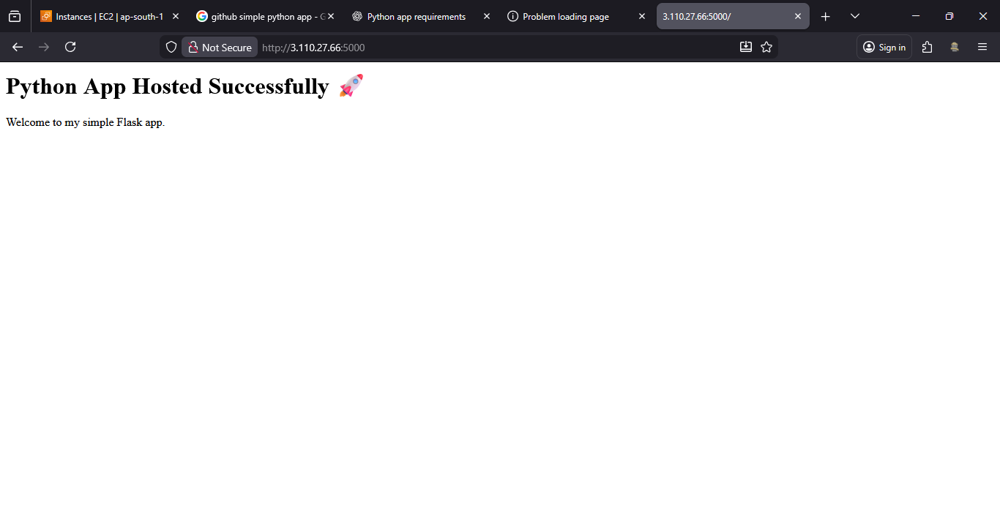

# Python Application Deployment Guide

This document explains step-by-step how to set up and deploy a Python application.
---
## 1. Check Python Installation

```bash
python3 -v
```
If not installed:

```bash
sudo yum install python3 -y
```
---
## 2. Install Required Packages
```bash
sudo yum install python3-pip python3-virtualenv -y
```
---
## 3. Create  Directory
```bash
mkdir pythonapp
cd pythonapp
```
---
## 4. Create Virtual Environment

```bash
python3 -m venv myenv
```
To activate it:

```bash
source myenv/bin/activate
```
---
## 5. Create Application Files
### requirements.txt
```
flask
gunicorn
```

### app.py
```python
from flask import Flask

app = Flask(__name__)

@app.route('/')
def home():
    return "Hello from Python App"

if __name__ == '__main__':
    app.run()
```
---
## 6. Install Dependencies

```bash
pip install -r requirements.txt
```
---
## 7. Run App

```bash
python3 app.py
```
Make sure port 5000 is open.

---
## 8. Run App in Background (Gunicorn)

```bash
gunicorn --bind 0.0.0.0:5000 app:app --daemon
```
---

## 9. Install & Configure Nginx

```bash
sudo yum install nginx -y
sudo service nginx start
```
Edit config:

```bash
sudo nano /etc/nginx/nginx.conf
```
Add reverse proxy pass:

```nginx
location / {
    proxy_pass http://localhost:5000;
}
```

Reload Nginx:

```bash
sudo service nginx reload
```
---
## To access App
```
http://<server-ip>
```
<p align="center">
  
</p>

