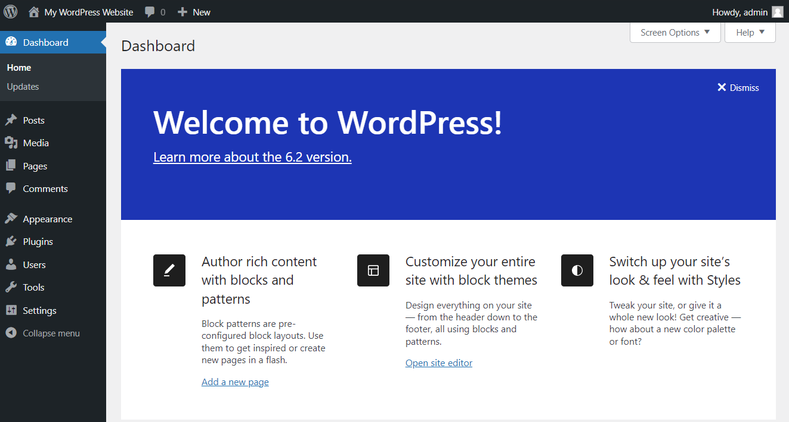

# WordPress Deployment & Management
This documents the **process of installing, configuring, managing, backing up, and restoring a WordPress website** on a Linux server using **Nginx, MySQL, PHP**. It also covers **FTP access, security basics, and common operations**.
---

## Architecture Overview
- **Web Server**: Nginx
- **Database**: MySQL / MariaDB
- **Backend**: PHP-FPM (PHP 8.x)
- **CMS**: WordPress
- **Access**: SSH, FTP (vsftpd)
---

## 1. Server Preparation
### Update System
```bash
sudo yum update -y   # Amazon Linux
```

### Install Nginx
```bash
sudo yum install nginx -y
sudo systemctl start nginx
sudo systemctl enable nginx
```

### Install PHP & PHP-MySQL connectar
```bash
sudo yum install php php-fpm php-mysqlnd php-gd php-xml php-mbstring php-json -y
sudo systemctl start php-fpm
sudo systemctl enable php-fpm
```

### Install MySQL / MariaDB
```bash
sudo yum install mariadb105-server -y
sudo systemctl start mariadb
sudo systemctl enable mariadb
```

## 2. Database Configuration
Login to MySQL:
```bash
sudo mysql -u root -p
```
Create database and user:
```sql
CREATE DATABASE wordpressdb;
CREATE USER 'wpuser'@'localhost' IDENTIFIED BY 'password';
GRANT ALL PRIVILEGES ON wordpressdb.* TO 'wpuser'@'localhost';
FLUSH PRIVILEGES;
EXIT;
```
## 3. Download & Configure WordPress

```bash
cd /usr/share/nginx/html
sudo wget https://wordpress.org/latest.zip
sudo unzip latest.zip
sudo chown -R 755 html/
```

Configure WordPress:
```bash
cd wordpress
cp wp-config-sample.php wp-config.php
```

Edit database details:
```bash
sudo nano wp-config.php
```

```php
define('DB_NAME', 'wordpressdb');
define('DB_USER', 'wpuser');
define('DB_PASSWORD', 'password');
define('DB_HOST', 'localhost');
```

---

## 4. Nginx Configuration
Edit Nginx config:
```bash
sudo nano /etc/nginx/nginx.conf
```

Set document root:
```nginx
root /usr/share/nginx/html/wordpress;
index index.php index.html;
```

Restart services:
```bash
sudo systemctl restart nginx
sudo systemctl restart php-fpm
```

## 5. WordPress Installation

Open browser:
```
http://<SERVER-IP>
```

Complete WordPress setup:
- Site title
- Admin username
- Password
- Email

⚠️ **Do not share admin credentials**.

## 6. FTP Configuration (vsftpd)
**When install plugins in our website**

### Install FTP
```bash
sudo yum install vsftpd -y
sudo systemctl start vsftpd
sudo systemctl enable vsftpd
```

### Create FTP User
```bash
sudo useradd ftpuser
sudo passwd ftpuser
```
### FTP Login
- Hostname: Server IP
- Username: ftpuser
- Password: ******
---

## 7. Backup Procedure when to download database and access when lost IP-Address
### Database Backup
```bash
mysqldump -u root -p wordpressdb > wordpressdb.sql
```
Download backups locally using SCP:
```bash
scp -i key.pem user@server-ip:/path/to/file .
```

## 8. Restore Procedure
### Restore Database
```bash
sudo mysql -u root -p wordpressdb < wordpressdb.sql
```

Restart services:
```bash
sudo systemctl restart nginx
sudo systemctl restart php-fpm
```

## 9. Domain & URL Changes
If domain changes, update WordPress URLs in database:
```sql
UPDATE wp_options SET option_value='http://new-domain.com' WHERE option_name IN ('siteurl','home');
```

## 10. Common Verification
- Website accessible: `http://<ip or domain>`
- Admin panel: `http://<ip or domain>/wp-admin`

- Services running:
```bash
systemctl status nginx
systemctl status php-fpm
systemctl status mariadb
```
